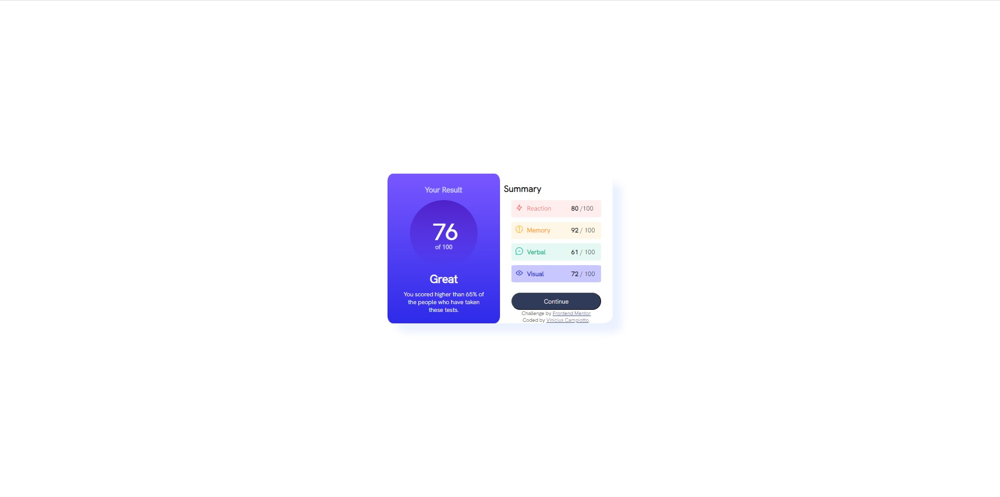

# Frontend Mentor - Results summary component solution

This is a solution to the [Results summary component challenge on Frontend Mentor](https://www.frontendmentor.io/challenges/results-summary-component-CE_K6s0maV). Frontend Mentor challenges help you improve your coding skills by building realistic projects.

### The challenge

Users should be able to:

- View the optimal layout for the interface depending on their device's screen size
- See hover and focus states for all interactive elements on the page

### Screenshot

### Links

- Solution URL:(https://app.netlify.com/sites/bucolic-blancmange-80a346/overview)

## My process

First time building something like this! I liked, but i had some dificulty, is time to study again and and keep progressing!

### Built with

- Semantic HTML5 markup
- CSS custom properties
- Flexbox
- Gradient color
- Responsive

### What I learned

I learned more about color gradient and opacity.

### Continued development

I have in mind to consolidate my knowledge with strong foundations and continue to advance to languages ​​and tools.

## Author

- Website - [Vinicius Campiotto](https://app.netlify.com/teams/campiottocodes/overview)
- Frontend Mentor - [@Campiottocodes](https://www.frontendmentor.io/profile/Campiottocodes)
